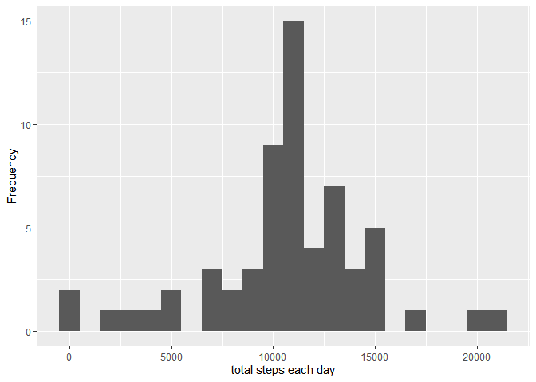

## Introduction
It is now possible to collect a large amount of data about personal movement using activity monitoring devices such as a Fitbit, Nike Fuelband, or Jawbone Up. These type of devices are part of the “quantified self” movement – a group of enthusiasts who take measurements about themselves regularly to improve their health, to find patterns in their behavior, or because they are tech geeks. But these data remain under-utilized both because the raw data are hard to obtain and there is a lack of statistical methods and software for processing and interpreting the data.

This assignment makes use of data from a personal activity monitoring device. This device collects data at 5 minute intervals through out the day. The data consists of two months of data from an anonymous individual collected during the months of October and November, 2012 and include the number of steps taken in 5 minute intervals each day.

The data for this assignment can be downloaded from the course web site:

* Dataset: [Activity monitoring data](https://d396qusza40orc.cloudfront.net/repdata%2Fdata%2Factivity.zip) 

steps: Number of steps taking in a 5-minute interval (missing values are coded as 𝙽𝙰) </br>
date: The date on which the measurement was taken in YYYY-MM-DD format </br>
interval: Identifier for the 5-minute interval in which measurement was taken </br>
The dataset is stored in a comma-separated-value (CSV) file and there are a total of 17,568 observations in this dataset. 

## Loading and preprocessing the data

Load data, unzip it and read into data frame.


```r
library(ggplot2)
Sys.setlocale("LC_TIME", "English") 
```

```
## [1] "English_United States.1252"
```

```r
fileUrl = "https://d396qusza40orc.cloudfront.net/repdata%2Fdata%2Factivity.zip"
fileName = "activitydata.zip"

if(!file.exists(fileName)){
        download.file(fileUrl, fileName, mode = "wb")    
}
unzip(fileName, exdir = "data")

activity = read.csv("data/activity.csv")
```

## What is total number of steps taken per day?

Calculate the total number of steps taken each day and draw a histogram.


```r
totalStepsByDay = aggregate(steps ~ date, data = activity, FUN = sum)
qplot(totalStepsByDay$steps, binwidth=1000, ylab="Frequency", xlab="total steps each day")
```

<!-- -->

## Mean and median number of steps taken each day


```r
mean(totalStepsByDay$steps, na.rm = TRUE)
```

```
## [1] 10766.19
```

```r
median(totalStepsByDay$steps, na.rm = TRUE)
```

```
## [1] 10765
```

## Time series plot of the average number of steps taken


```r
stepsByInterval <- aggregate(steps ~ interval, data = activity, FUN = mean)
qplot(stepsByInterval$interval, stepsByInterval$steps, geom = "line", 
      xlab = "5 minute interval", ylab = "average number of steps")
```

<!-- -->
## 5-minute interval that on average accross all the day in the dataset contains the maximum number of steps.


```r
stepsByInterval[which.max(stepsByInterval$steps),1]
```

```
## [1] 835
```

## Imputing missing values

Missing values in the dataset:


```r
sum(!complete.cases(activity))
```

```
## [1] 2304
```

Missing values are imputed by using average value for each interval.


```r
imputed <- transform(activity, steps = ifelse(is.na(activity$steps),
        stepsByInterval$steps[match(activity$interval, stepsByInterval$interval)],
        activity$steps))
```

Histogram of the imputed data:


```r
imputedStepsByDay <- aggregate (steps ~date, data = imputed, FUN = sum)
qplot(imputedStepsByDay$steps, binwidth=1000, ylab="Frequency", xlab="total steps each day")
```

<!-- -->

Mean and median of the imputed data:


```r
mean(imputedStepsByDay$steps)
```

```
## [1] 10766.19
```

```r
median(imputedStepsByDay$steps)
```

```
## [1] 10766.19
```

## Panel plot of activity patterns during weekdays and weekend


```r
weekendDays <- c("Saturday", "Sunday")
imputed$weekday <- as.factor(ifelse(is.element(weekdays(as.Date(imputed$date)),
        weekendDays),"Weekend", "Weekday" ))


imputedStepsByInterval <- aggregate(steps ~ interval + weekday,data = imputed,FUN = mean)

ggplot(imputedStepsByInterval, aes(interval, steps)) + geom_line() + facet_wrap(~weekday)+
        xlab("5 minute interval") +ylab("average number of steps")
```

<!-- -->

